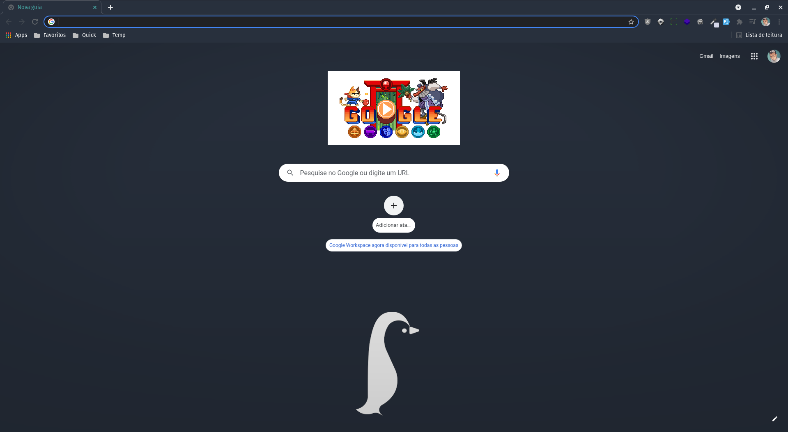

<h1 align="center">
   
  
    
  Pinguim Criativo Theme for <a href="https://www.google.com/chrome/">Google Chrome</a>
   
</h1>

  

> A simple theme using a Pinguim Criativo color palette.

 

# Installation

#### Install

1. Install theme through the [Google Chrome Store](https://chrome.google.com/webstore/detail/pinguim-criativo-theme-fo/iodcoanhiikmojkcnbjkijblmfjckhlh?hl=pt-br).

 

# Maintainer

[Durval Henrique 
(Lavrudinho)](https://github.com/Lavrudin)

 

# License

[MIT License](./LICENSE.md)
